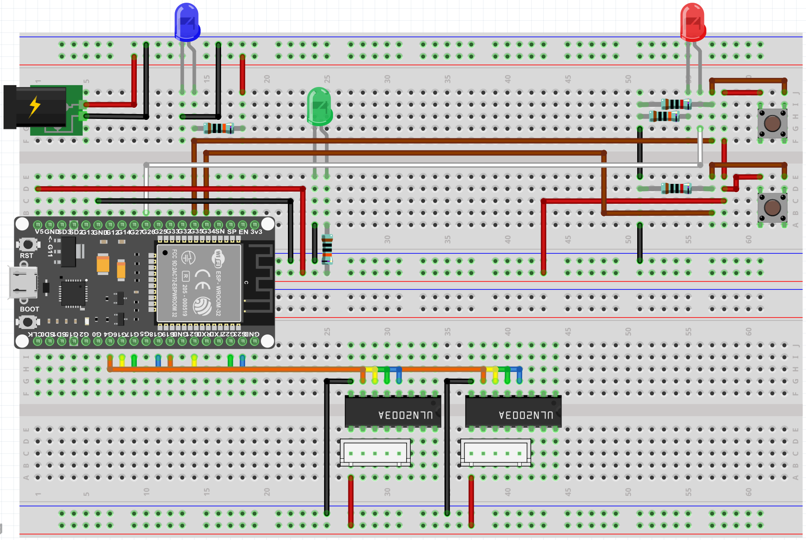

# Nail Braille


### About

Nail Braille is an innovative project aimed at revolutionizing the way people learn and interact with Braille. This project uses affordable components and 3D-printed parts to create a unique and effective learning tool.

This project earned the Platinum Award for Innovation at the 2023 Canada Wide Science Fair. For more information, visit the project page [here](https://projectboard.world/ysc/project/nail-braille-a-novel-approach-towards-braille-education-gnzdel).

### Overview

- [Requirements](#requirements)
  - [Hardware](#hardware)
  - [Software](#software)
- [Setup](#setup)
  - [Arduino](#arduino)
  - [Web Interface](#web-interface)
    - [Wiring](#wiring)
- [Installation](#installation)

### Requirements

#### Hardware

- 2 Breadboards
- 1 ESP32 Dev board
- 2 Buttons
- 3 LEDs (Red, Green, Blue)
- 1 100K Ohm resistor
- 2 10K Ohm resistors
- 2 1K Ohm resistors
- 2 28BYJ-48 Stepper motors and their controllers (ULN2003A)
- Male to male jumper wires
- 12v DC power supply
- DC female plug
- USB-A to micro-USB cable

#### Software

- Node.js
- npm

### Setup

#### Wiring

Wire the components as shown below.



#### Arduino

1. Flash your microcontroller of choice with the sketch found in `microcontroller/Braille`

_Note: Your microcontroller must be Arduino compatible_

#### Web Interface

1. 3D print the Braille disks and base found in the `/models` directory.
2. Wire the components according to the diagram below.
3. Place the disks on the motors and the motors in the base.
4. Connect the motors to the motor controllers.

### Installation

```bash
# Clone the repository
git clone https://github.com/Moulik-Budhiraja/Nail-Braille.git
```

_Change line 4 of `server/index.ts` to the correct serial port for your Arduino._

In individual terminal instances:

```bash
# Install and run the client
cd Nail-Braille/client
npm install
npm run dev
```

```bash
# Install and run the server
cd Nail-Braille/server
npm install
npm start
```
